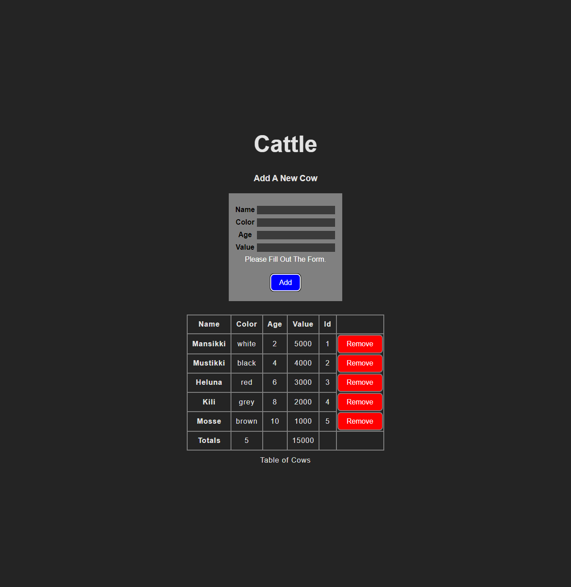

# Cows List

## Screenshot

## Description

The App displays a list of cows.
 
The cows can be added and removed.
 
The form uses a basic validation.

## Installing and start up

Install dependencies by running the command npm install.
 
Start the program by running the command npm run dev in the terminal.

## Project details

This project is made with React+Vite and runs on localhost (http://127.0.0.1:5173/).

## Design decisions

The App is written using Hooks (New React).
 
The App is divided into components that use helpers from the init and utils folders.
 
Styles are created with CSS.

## Known errors

-
